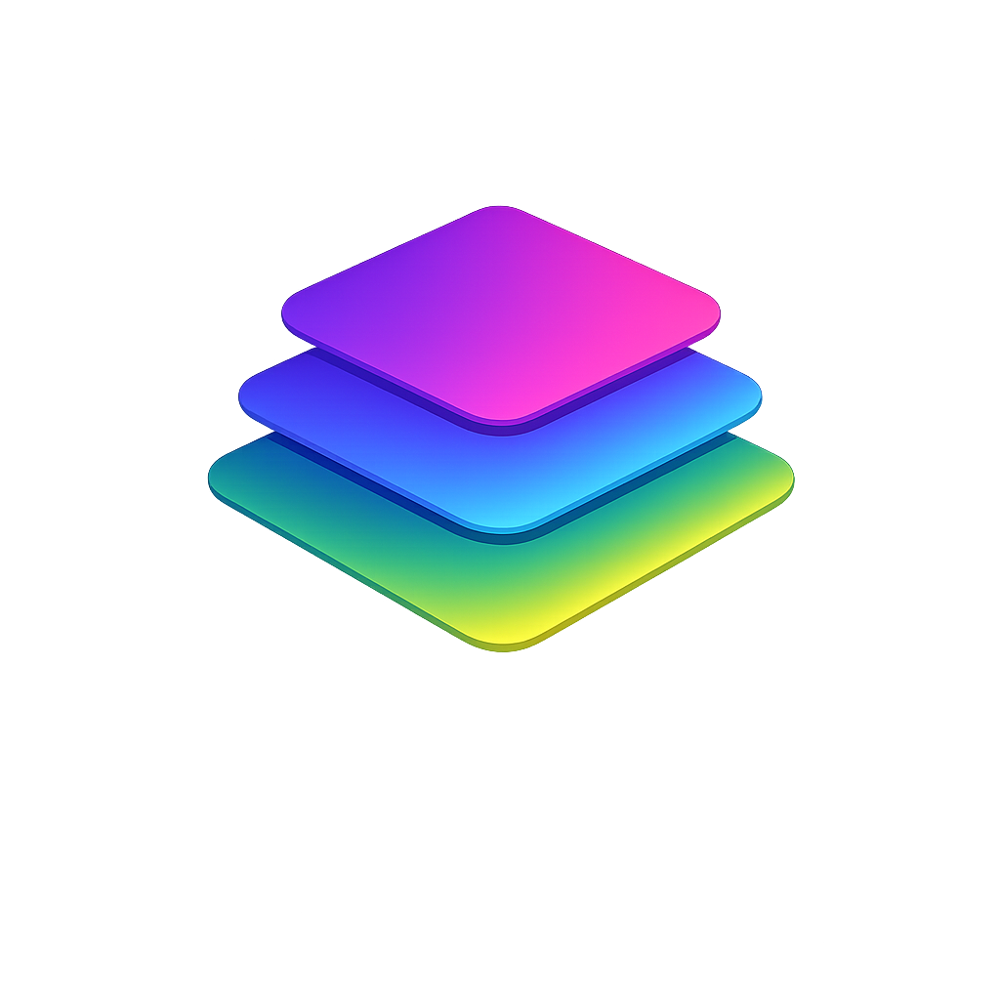
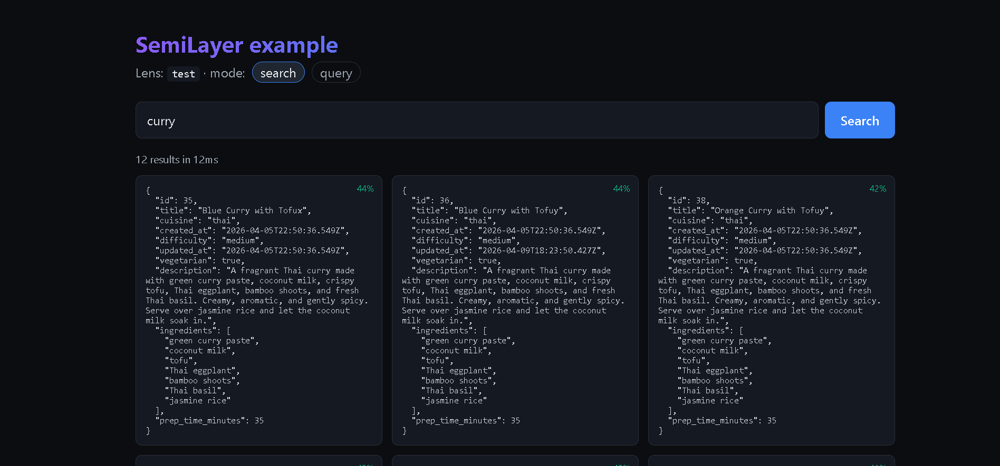

<p align="right">
  
  <br />
  <strong>SemiLayer / example-frontend</strong>
</p>

<p align="right">
A minimal <a href="https://vitejs.dev/">Vite</a> + React 19 app that talks to a <a href="https://semilayer.com">SemiLayer</a> lens using <a href="https://www.npmjs.com/package/@semilayer/react"><code>@semilayer/react</code></a> hooks on top of <a href="https://www.npmjs.com/package/@semilayer/client"><code>@semilayer/client</code></a>.
</p>

---

It demonstrates three modes — the three shapes most apps actually need:

1. **Semantic search** — `useSearch(lens, { query })`
2. **Structured query** — `useQuery(lens, { where, orderBy, limit })`
3. **Streaming search** — `useStreamSearch(lens, { query })` for progressive rendering over WebSocket

The whole app is ~150 lines of React. Clone it, point it at a lens, and
you're searching.



> **Companion repo:** [`semilayer/example-backend`](https://github.com/semilayer/example-backend)
> shows the same lens being queried from a Node script — useful for jobs,
> scripts, and server-side rendering.

---

## Prerequisites

- Node **22+**
- `pnpm` (or `npm` / `yarn` — swap the commands below)
- A **SemiLayer project** with at least one lens defined and ingested.
  If you don't have one yet, follow the 5-minute setup below first.

## 5-minute SemiLayer setup

If you've never set up a SemiLayer project, do this once — from any
directory, not inside this repo:

```bash
# 1. Install the CLI
pnpm add -g @semilayer/cli

# 2. Sign in (opens your browser)
semilayer login

# 3. Scaffold a project in an empty folder.
#    This creates `sl.config.ts` and a local `.semilayerrc`, and will
#    offer to create a new org / project / environment interactively.
mkdir my-semilayer && cd my-semilayer
semilayer init

# 4. Connect a data source (e.g. a Postgres database). You'll be prompted
#    for the connection string; credentials are encrypted server-side.
semilayer sources connect

# 5. Edit sl.config.ts to declare a lens (a table + the facets you want).
#    Minimal example:
#
#      lenses: {
#        recipes: {
#          source: 'postgres',
#          table: 'recipes',
#          fields: { id: { type: 'number', primaryKey: true }, title: { type: 'text' }, description: { type: 'text' } },
#          facets: { search: { mode: 'semantic', fields: ['title', 'description'] } },
#          rules: { query: 'public' },
#        },
#      }

# 6. Push the config — this creates the lens and starts the first full ingest.
semilayer push

# 7. Watch the ingest finish.
semilayer status

# 8. Mint a publishable key (pk_...) for the browser.
#    Publishable keys honor per-lens access rules and are safe to ship.
semilayer keys create --type pk --name "browser"
```

Copy the `pk_...` key that `keys create` prints — you'll paste it into
`.env.local` below.

---

## Run this example

```bash
git clone https://github.com/semilayer/example-frontend
cd example-frontend
pnpm install

cp .env.example .env.local
# Edit .env.local: set VITE_SEMILAYER_URL, VITE_SEMILAYER_KEY, VITE_SEMILAYER_LENS

pnpm dev
# → http://localhost:5173
```

### Environment variables

| Variable | Default | Meaning |
|---|---|---|
| `VITE_SEMILAYER_URL` | `http://localhost:3001` | SemiLayer service URL — local dev or `https://api.semilayer.com` for hosted |
| `VITE_SEMILAYER_KEY` | — | Publishable key (`pk_...`) for the environment |
| `VITE_SEMILAYER_LENS` | `recipes` | Name of the lens declared in your `sl.config.ts` |

---

## What's in here

```
example-frontend/
├── src/
│   ├── beam.ts          # single shared BeamClient, handed to the provider
│   ├── App.tsx          # search / query / stream UI (toggle at the top)
│   ├── App.css
│   └── main.tsx         # wraps <App /> in <SemiLayerProvider>
├── index.html
├── vite.config.ts
├── tsconfig.json
└── .env.example
```

The integration is `src/beam.ts` (one `BeamClient`), `src/main.tsx`
(one `<SemiLayerProvider client={beam}>`), and three hook calls in
`src/App.tsx`:

```tsx
const search = useSearch(LENS, submitted ? { query: submitted, limit: 12 } : null)
const stream = useStreamSearch(LENS, submitted ? { query: submitted, limit: 50 } : null)
const query  = useQuery(LENS, { limit: 12, orderBy: { field: 'id', dir: 'desc' } }, { enabled: false })
```

Each hook handles its own loading / error / cleanup state — you read
from it, you don't await it. See the
[React hooks reference](https://semilayer.dev/reference/react-hooks)
for the full API (provider options, `useSimilar`, `useSubscribe`,
`useObserve`).

---

## Generating a typed client (optional)

For a real app you'll want type-safe calls like
`beam.recipes.search({ query })` instead of the untyped `beam.search('recipes', ...)`
this example uses. Run:

```bash
semilayer generate
```

in the directory that has your `sl.config.ts`, commit the generated
`beam.ts`, and import from it instead of `@semilayer/client` directly.
We kept the untyped form here so the example has zero generated code
and zero tooling steps.

---

## License

MIT
